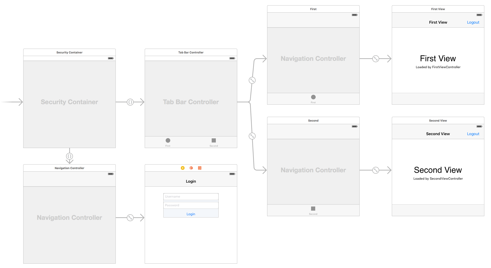

SecurityContainer iOS
=====================

Security Container implements lock screen UI pattern.

When in locked state, rest of the app is fully unloaded from memory.

Read here: https://paiv.github.io/blog/2016/08/18/security-container-ios.html

Using in your app
-----------------

Demo app storyboard:

Add to storyboard new `UIViewController` and change its class to `SecurityContainer`. Mark it as initial view controller.

Add two outgoing segues with custom class `SecuritySegue`: one with identifier `locked` leading to login, another with identifier `unlocked` to the rest of the app.

Note: when changing default class of an element in storyboard, be sure to set proper module.

When linking to framework project, add it to `Embedded Binaries` of your project.

Invoking security screen
------------------------

Your view controllers now have access to optional property `securityContainer` and its two methods:
* `securityLock()` will navigate to `locked` segue
* `securityUnlock()` will navigate to `unlocked` segue

See [DemoApp](DemoApp) for example implementation.
